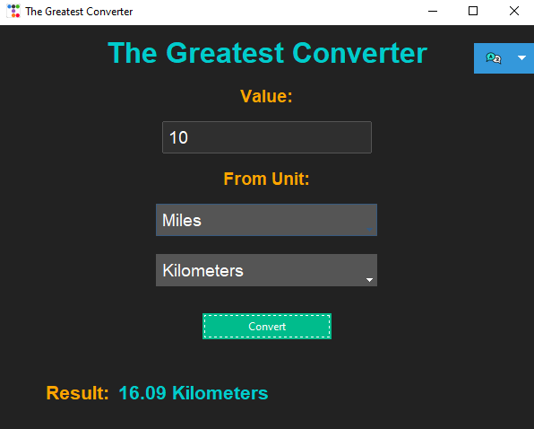

# 🌟 The Greatest Converter 🌟



Welcome to **The Greatest Converter**, a versatile unit conversion tool built with Python and Tkinter! Easily convert between different units such as distance, weight, temperature, and more!

## 🚀 Features

- **Intuitive Interface**: Simple, user-friendly design with a dark theme.
- **Multiple Unit Conversions**: Supports conversions between kilometers, miles, kilograms, pounds, Celsius, Fahrenheit, and more.
- **Multi-language Support**: Switch between English, Ukrainian, and Slovak languages easily.
- **Customizable**: Adapt the tool to your preferences by modifying the source code.

## 🌐 Language Translation Screenshots

### English


### Ukrainian


### Slovak


## 🛠 Installation

1. **Clone the repository**:
   ```bash
   git clone https://github.com/yourusername/the-greatest-converter.git
   cd the-greatest-converter
   ```

2. **Install the dependencies**:
   ```bash
   pip install -r requirements.txt
   ```

3. **Run the application**:
   ```bash
   python main.py
   ```

## 💻 Usage

1. **Launch the application**: After running the application, you'll be greeted with the main interface.

2. **Select the unit to convert**: Use the drop-down menus to choose the unit you want to convert from and to. Options include kilometers, miles, kilograms, pounds, Celsius, Fahrenheit, etc.

3. **Enter the value**: Type the value you want to convert into the provided input field.

4. **Convert**: Click the "Convert" button to see the result. The converted value will be displayed in the result area.

5. **Switch Languages**: To change the language of the interface, click the language switch button in the top-right corner and select from English, Ukrainian, or Slovak.

## 🔄 Convert to `.exe`

To create an executable file:

```bash
pyinstaller --onefile --windowed main.py
```

The `.exe` file will be located in the `dist` folder.

